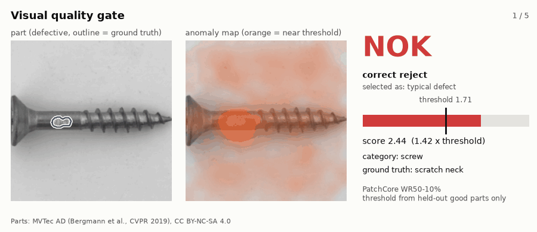
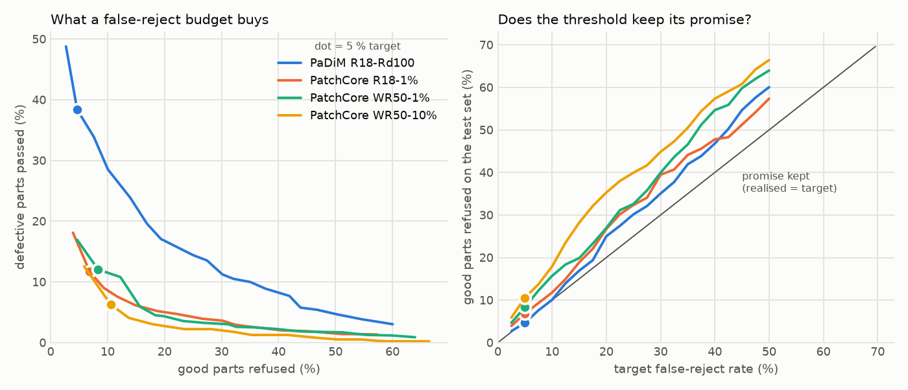
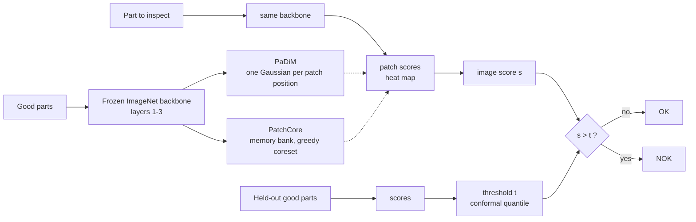

# visual-quality-gate

**A training-free visual quality gate for an Industry 4.0 (Usine 4.0) line: PaDiM and PatchCore re-implemented from scratch in PyTorch, measured on five MVTec AD categories, and judged on the question a line manager asks: how many good parts do I refuse to stop how many defects?**

[](https://github.com/guilhem0908/visual-quality-gate/actions/workflows/ci.yml)

[Results](#results) - [Quickstart](#quickstart) - [How it works](#how-it-works) - [Limitations](#limitations)



*Five test parts scored by PatchCore WR50-10% (seed 0), picked by a fixed rule on the ratio r = score / threshold over the five categories: the median caught defect, the median accepted good part, the caught defect with the smallest r, the defective part with the lowest r (the worst escape; the one part whose defect lies outside the cropped input is skipped, see Limitations) and the good part with the highest r (the worst false reject). Images: MVTec AD, CC BY-NC-SA 4.0.*

## Why this exists

In my first engineering year I co-wrote, with a classmate, a colour-ball detector in plain C: RGB thresholds, then the largest connected component (repository `PFR`). That recipe works when the thing to find is a colour you can name in advance; a scratch on a screw thread is not. This repository is the learned-feature successor of that idea: the detector only ever sees good parts, and the accept/reject threshold is also set from good parts only, because that is all a line has on its first day. My class runs a final-year team project on the Industry 4.0 smart factory (Usine 4.0) this year; this repository is a personal side project, separate from it, built in October 2026 with AI coding assistance (see the commit trailers). Its goal is to know the two reference methods well enough to re-derive them, and to see what a headline AUROC is worth once a threshold has to be chosen.

## Results

<!-- results:verdict -->
**With a threshold set from held-out good parts only (target: 5 % false rejects), PatchCore WR50-10% lets 85 / 1353 (6.3 %) defective parts through but refuses 43 / 408 (10.5 %) good parts, 2.1 times the target; PaDiM R18-Rd100 stays at 19 / 408 (4.7 %) false rejects and lets 519 / 1353 (38.4 %) defective parts through.**
<!-- /results:verdict -->

Five categories, 3 seeds (per-category image counts in [docs/design.md](docs/design.md)); a seed changes the fit/held-out split of the good training images, PaDiM's random channels and PatchCore's coreset. Counts are summed over the seeds, so every test part is counted three times.

<!-- results:findings -->
- **AUROC hides the operating point.** On screw, PatchCore WR50-10% reaches 96.5 % image AUROC and still passes 73 / 357 (20.4 %) defective parts at the 5 % target.
- **The false-reject promise is not always kept.** On exchangeable good parts the rule would refuse 5.9 ± 2.9 of the 136 good test parts per seed. Realised rates: PaDiM R18-Rd100 4.7 %, PatchCore R18-1% 6.9 %, PatchCore WR50-1% 8.3 %, PatchCore WR50-10% 10.5 %. Above the promise by more than two standard deviations in every seed: PatchCore WR50-10%.
- **The reimplementation tracks the papers.** 20 of the 25 published per-category values are matched within 1 point; the largest gap is -2.4 points (PatchCore WR50-1%).
<!-- /results:findings -->

**Accuracy against the papers.** AUROC in %, image level / pixel level, fit on all good training images, mean of 3 seeds. "paper" is the value published by the authors for the same category.

<!-- results:accuracy -->
| Category | PaDiM R18-Rd100 | paper | PatchCore R18-1% | PatchCore WR50-1% | paper | PatchCore WR50-10% | paper |
| :-- | --: | --: | --: | --: | --: | --: | --: |
| bottle | 99.7 / 98.0 | - / 98.1 | 100.0 / 97.7 | 100.0 / 98.3 | 100.0 / 98.5 | 100.0 / 98.4 | 100.0 / 98.6 |
| grid | 92.2 / 93.6 | - / 94.9 | 95.2 / 95.9 | 97.6 / 96.9 | 98.6 / 98.6 | 97.9 / 97.6 | 97.9 / 98.7 |
| metal_nut | 98.3 / 96.3 | - / 96.7 | 99.7 / 97.6 | 99.8 / 98.5 | 99.7 / 98.4 | 99.9 / 98.6 | 100.0 / 98.4 |
| screw | 79.1 / 97.3 | - / 97.4 | 95.2 / 98.6 | 94.0 / 97.9 | 96.4 / 99.2 | 96.5 / 98.9 | 97.0 / 99.4 |
| zipper | 89.5 / 98.2 | - / 98.2 | 97.8 / 98.6 | 99.7 / 98.3 | 99.2 / 98.8 | 99.4 / 98.3 | 99.5 / 98.9 |
| **mean** | 91.8 / 96.7 | - / 97.1 | 97.6 / 97.7 | 98.2 / 98.0 | 98.8 / 98.7 | 98.7 / 98.3 | 98.9 / 98.8 |
<!-- /results:accuracy -->

Setup differences: the papers give one value per category, here it is a 3-seed mean; the PaDiM paper has no per-category image-level value for ResNet-18; this PatchCore keeps the concatenated layer-2 and layer-3 features (384 or 1536 channels) where the official code pools them to 1024, and it does not apply the paper's image-score re-weighting. The largest gaps are on screw at image level (WR50-1%) and on grid at pixel level; I did not test whether the missing pooling explains them.

**The gate at a 5 % false-reject target.** Fit on 80 % of the good training images, threshold from the other 20 %, verdicts on the test set. *Shift* is the AUROC of test-good scores against held-out-good scores: 50 % means the two sets are indistinguishable, which is what the threshold rule assumes; the more a detector memorises its training images, the less that holds here.

<!-- results:gate -->
| Configuration | False rejects (good parts refused) | per seed | Escapes (defective parts passed) | per seed | Worst category for escapes | Shift (%) |
| :-- | --: | --: | --: | --: | --: | --: |
| *what the rule promises* | 4.3 % | 5.9 ± 2.9 | - | - | - | 50.0 |
| PaDiM R18-Rd100 | 19 / 408 (4.7 %) | 4 to 10 | 519 / 1353 (38.4 %) | 161 to 185 | screw: 295 / 357 (82.6 %) | 56.4 |
| PatchCore R18-1% | 28 / 408 (6.9 %) | 8 to 12 | 158 / 1353 (11.7 %) | 44 to 58 | screw: 112 / 357 (31.4 %) | 55.7 |
| PatchCore WR50-1% | 34 / 408 (8.3 %) | 9 to 13 | 163 / 1353 (12.0 %) | 44 to 60 | screw: 145 / 357 (40.6 %) | 60.1 |
| PatchCore WR50-10% | 43 / 408 (10.5 %) | 12 to 17 | 85 / 1353 (6.3 %) | 18 to 38 | screw: 73 / 357 (20.4 %) | 62.1 |
<!-- /results:gate -->



**CPU cost.** One image at a time, from the preprocessed tensor to score and heat map; fit from decoded images to fitted detector. The laptop was running other jobs during the measurement, so only large differences mean anything: the ResNet-18 rows come out slower than the Wide-ResNet-50 rows, which the compute does not explain; I attribute it to the other jobs, not to the methods. Detector size is exact.

<!-- results:cost -->
Measured on `screw` (320 good training images), Intel(R) Core(TM) i9-14900HX, 4 threads, PyTorch 2.11.0, while other programs were using 54 % of the CPU.

| Configuration | Mean image AUROC (%) | Fit (s) | Latency median (ms) | Latency p95 (ms) | Detector (MB) | Peak RSS (MB) |
| :-- | --: | --: | --: | --: | --: | --: |
| PaDiM R18-Rd100 | 91.8 | 112.7 | 405.1 | 496.9 | 126.7 | 908 |
| PatchCore R18-1% | 97.6 | 79.4 | 368.6 | 467.5 | 3.9 | 793 |
| PatchCore WR50-1% | 98.2 | 159.5 | 221.0 | 248.9 | 15.4 | 1125 |
| PatchCore WR50-10% | 98.7 | 180.7 | 334.1 | 390.9 | 154.1 | 1516 |
<!-- /results:cost -->

## How it works



- **Features.** A torchvision ResNet-18 or Wide-ResNet-50-2 pretrained on ImageNet is frozen; nothing is trained. Images are resized to 256 px and centre-cropped to 224 px.
- **PaDiM** (`padim.py`). 100 random channels of layers 1-3 on a 56 x 56 grid; per position, a mean and a covariance with a 0.01 ridge. Score: Mahalanobis distance $M(x)=\sqrt{(x-\mu)^\top\Sigma^{-1}(x-\mu)}=\lVert L^{-1}(x-\mu)\rVert$ with $\Sigma=LL^\top$.
- **PatchCore** (`patchcore.py`, `coreset.py`). 3 x 3-averaged features of layers 2-3 on a 28 x 28 grid; the memory bank keeps 1 % or 10 % of the training patches, chosen by greedy k-centre selection (farthest-first, a 2-approximation of $\min_C \max_x \min_{c\in C}\lVert x-c\rVert$) in a 128-d random projection. Score: distance to the nearest stored patch.
- **Heat map and image score** (`maps.py`). Patch scores are upsampled and smoothed (Gaussian, sigma 4 px); the image score is their maximum.
- **Threshold** (`gate.py`). With n held-out good scores sorted increasingly, $t=s_{(k)}$, $k=\lceil(n+1)(1-\alpha)\rceil$. If future good parts are exchangeable with the held-out ones, $P(s>t)\le\alpha$. It needs $n\ge 1/\alpha-1$: 19 parts for 5 %, 99 for 1 %.

Derivations, the proof sketches and every design decision are in [docs/design.md](docs/design.md).

## Quickstart

No dataset is needed to run the tests and to recompute the tables from the committed per-image scores.

```bash
git clone https://github.com/guilhem0908/visual-quality-gate.git
cd visual-quality-gate
python -m venv .venv && source .venv/bin/activate
pip install -e ".[dev]"
pytest -m "not dataset"
python scripts/reproduce.py --stages report
python scripts/check_readme.py
```

Windows PowerShell:

```powershell
git clone https://github.com/guilhem0908/visual-quality-gate.git; cd visual-quality-gate
python -m venv .venv; .\.venv\Scripts\Activate.ps1
pip install -e ".[dev]"
pytest -m "not dataset"
python scripts\reproduce.py --stages report; python scripts\check_readme.py
```

Full reproduction (downloads about 840 MB of MVTec AD and the torchvision weights, then refits everything):

```bash
python scripts/fetch_mvtec.py
python scripts/reproduce.py
```

## Repository layout

```text
src/vqgate/
  padim.py  patchcore.py  coreset.py   the two detectors, greedy k-centre selection
  maps.py  metrics.py  gate.py         heat map, AUROC from ranks, conformal threshold
  backbone.py  data.py  inspector.py   frozen ResNet, MVTec AD index, image in -> score out
  experiment.py  latency.py            benchmark runner, CPU fit time, latency and memory
  report.py  figures.py  published.py  tables and summary, figures, values copied from the papers
scripts/  fetch_mvtec.py  reproduce.py  check_readme.py
results/  per-image scores (CSV); benchmark, latency, hero and summary (JSON)
tests/    synthetic-data tests (test_dataset.py needs the images)
docs/     design.md (derivations and decisions), hero.gif, tradeoff.png
```

## Limitations

- Five of the fifteen MVTec AD categories, so no all-category average comparable with the papers.
- Small test sets: 20 to 41 good test parts per category, so one false reject moves a category rate by 2.4 to 5 points. Read the counts, not only the percentages.
- The threshold rule assumes that future good parts look like the held-out ones. The shift column shows this fails on this dataset, most for the largest memory bank; on a real line the held-out parts should come from another batch than the fit parts, and the realised false-reject rate should be monitored.
- With 42 to 64 held-out parts the threshold itself is noisy (see the per-seed escape counts), and a 1 % target cannot be certified at all.
- One defective test part (grid, glue/008, listed in `results/hero.json`) has its whole defect outside the 224 px crop the network sees, so it escapes with any method at this input size; it is counted in the tables and skipped by the animation.
- Not implemented: the PRO localisation metric, PatchCore's 1024-d pooling and score re-weighting, ONNX export, PaDiM on Wide-ResNet-50 (its covariances need 3.8 GB according to the paper).
- Timings come from one laptop that was running other jobs; the benchmark fits ran on its GPU, the latency table on its CPU. A CPU-only benchmark run works (a test refits two configurations and compares them with the committed scores) but was not timed end to end.
- Nothing here was tested on a real line: lighting, part positioning and camera drift are outside the scope.

## References

- T. Defard, A. Setkov, A. Loesch, R. Audigier, [PaDiM: a Patch Distribution Modeling Framework for Anomaly Detection and Localization](https://arxiv.org/abs/2011.08785), ICPR 2020 workshops.
- K. Roth, L. Pemula, J. Zepeda, B. Schoelkopf, T. Brox, P. Gehler, [Towards Total Recall in Industrial Anomaly Detection](https://arxiv.org/abs/2106.08265), CVPR 2022.
- P. Bergmann, M. Fauser, D. Sattlegger, C. Steger, [MVTec AD: A Comprehensive Real-World Dataset for Unsupervised Anomaly Detection](https://www.mvtec.com/company/research/datasets/mvtec-ad), CVPR 2019. Licence CC BY-NC-SA 4.0; the images are not redistributed here.
- T. Gonzalez, Clustering to minimize the maximum intercluster distance, Theoretical Computer Science 38, 1985 (greedy k-centre).
- A. Angelopoulos, S. Bates, [A Gentle Introduction to Conformal Prediction and Distribution-Free Uncertainty Quantification](https://arxiv.org/abs/2107.07511), 2021.
- [torchvision](https://pytorch.org/vision/stable/models.html) pretrained ResNet-18 and Wide-ResNet-50-2. Existing implementations, not used here: [anomalib](https://github.com/open-edge-platform/anomalib), [patchcore-inspection](https://github.com/amazon-science/patchcore-inspection).

Code under the MIT licence. `docs/hero.gif` shows MVTec AD images and is shared under CC BY-NC-SA 4.0.

---

Guilhem Carmouze - robotics engineering student, UPSSITECH (University of Toulouse) - LinkedIn https://www.linkedin.com/in/guilhem-carmouze/ - https://guilhem0908.github.io
